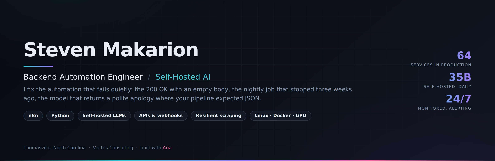

# Steven Makarion

**Backend automation engineer. Thomasville, North Carolina.**

I build and repair the automation that businesses run on, and I specialize in the half
nobody enjoys: what happens when it breaks quietly.

Loud failures get fixed the same day, because everyone can see them. The expensive ones are
silent. An API returns `200 OK` with an empty body. A nightly job stopped firing three weeks
ago and nothing errored. An LLM returns a polite apology where your workflow expected JSON,
and the pipeline reports success. Those are the ones I go after.

---

## What I run in production

Not a portfolio of demos. This is a live estate, maintained daily:

- **64 registered services** under one registry, with a reconciler that audits them twice a
  day. Anything not in the registry does not exist. Deadman switches, watchdogs, and health
  checks that verify by artifact rather than by exit code.
- **A self-hosted 35B language model**, serving continuously since June on hardware I own.
  NUMA-tuned from 0.9 to 9.5 tokens/sec on the same machine by pinning compute, memory, and
  GPU to one socket. A keepwarm holds a 92K-token prefix at 98% cache hit.
- **Three GPUs on explicit lanes**, so an image job cannot evict the model's cache.
- **Ten production websites**, plus the build standards behind them.
- **An event-time trading system** on paper capital, with counterfactual grading of every
  exit against a held-bracket baseline and reconciliation to broker fills rather than to
  internal ledgers.
- **CAD automation** against the Civil 3D API for a civil engineering firm, replacing manual
  drafting steps in a live production pipeline.

---

## Selected public work

**Systems and architecture**
- [llm-product-architecture](https://github.com/stevenmakarion/llm-product-architecture): what
  it takes to run a consumer AI product on your own hardware. Billing and consent, onboarding
  as a conversation, streaming chat with durable memory, async media, and the one guarded door
  every model call passes through. Includes the working guard.
- [service-estate](https://github.com/stevenmakarion/service-estate): a registry, a reconciler
  and a deadman for a fleet of small services. Verify by artifact, alert on the edge, fail
  open. It found a failed backup on its first run against a live 64-service estate.

**Self-hosted AI**
- [local-llm-deploy](https://github.com/stevenmakarion/local-llm-deploy): the measured numbers.
  Memory bandwidth decides MoE speed, not the GPU. Includes `numa_bench.py`, which found that
  the standard advice (interleave across nodes) is 23% slower here than pinning to one.

**Reliability**
- [pipeline-watch](https://github.com/stevenmakarion/pipeline-watch): catching the quiet
  failures: 200-with-garbage, a job that silently stopped, a log that stopped growing.
- [llm-guardrails](https://github.com/stevenmakarion/llm-guardrails): an LLM is not an API.
  An API fails loudly; an LLM fails plausibly. Five guards, zero dependencies, tested.

**Automation and integration**
- [n8n-lead-pipeline](https://github.com/stevenmakarion/n8n-lead-pipeline): speed-to-lead with
  sub-second acknowledgment, AI qualification, and explicit handling for every way the AI step
  can fail.
- [n8n-debugging-casebook](https://github.com/stevenmakarion/n8n-debugging-casebook): five
  production failure modes, each built broken and then fixed, with the canvases.

**Data acquisition**
- [resilient-scraper](https://github.com/stevenmakarion/resilient-scraper): a four-tier
  transport ladder. One site returned HTTP 200 to curl and "blocked by network security" to
  headless Chrome, same host, same minute. The wall was the fingerprint, not the IP.
- [job-radar](https://github.com/stevenmakarion/job-radar): multi-source polling, weighted
  scoring, dedup across runs, alert only on what is new.

---

## How I work

- **Asynchronous by default.** Send the repo, the error log, or the workflow export. No
  discovery call required.
- **Diagnosis before repair.** You get the root cause first, so you know what broke and why
  it will not happen again.
- **Verified by artifact.** "The service is running" is not "the model answers." I check the
  thing itself, not the status of the thing.
- **Fast.** Most fixes land in hours.

---

## How this gets built

I work with **Aria**, an AI partner I built and run on my own hardware. She co-authors the
commits in these repositories, and that is not a novelty line: the self-hosted 35B, the
service registry, the failure alerting and the guarded model calls documented here are the
same stack she runs on.

Which means when I build private AI for a client, I am not reasoning from a tutorial. I am
running the thing in production every day, and I have already met the failure modes.

---

## Available for

n8n builds, rescues, and Zapier-to-n8n migrations that end per-task billing · API and webhook
integration · Python data pipelines and scrapers that survive blocking · private self-hosted
AI for firms that cannot legally send client data to a public API · monitored automation on
a flat monthly retainer.

Agencies and consultancies welcome. I work quietly under someone else's brand without issue.

📍 Thomasville, NC (Eastern time) · [Vectris Consulting](https://vectrisconsulting.com)
